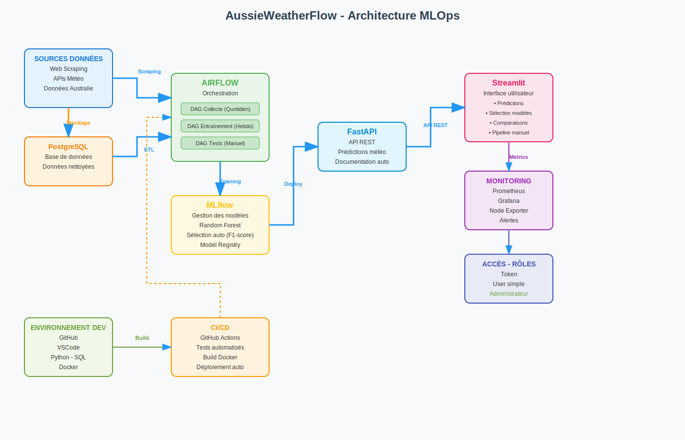

# AussieWeatherFlow

**Pipeline automatisé de prévision météo (pluie à J+1) en Australie avec déploiement MLOps complet**

## 🛠️ Stack Technique


---

## 🎯 Vue d'ensemble

Pipeline ML end-to-end automatisant la prédiction de pluie en Australie :
- **Collecte automatisée** des données météo
- **Entraînement** et sélection du meilleur modèle (Random Forest)
- **Déploiement continu** avec API REST et interface utilisateur
- **Monitoring** complet des performances

## 🏗️ Architecture



**Flux de données :** Scraping → ETL/Airflow → PostgreSQL → MLflow → API FastAPI → Dashboard Streamlit → Monitoring

## 🔄 Pipelines Airflow

### DAGs et orchestration

| DAG | Fréquence | Description |
|-----|-----------|-------------|
| **Collecte quotidienne** | Quotidien | Scraping, nettoyage, insertion BDD |
| **Entraînement** | Hebdomadaire | Training, validation, déploiement auto |
| **Pipeline unifié** | Manuel | Orchestration complète via Streamlit |
| **Tests** | À la demande | Validation pipelines et modèles |

### Fonctionnalités détaillées

**🔍 DAG Collecte :**
- **Task 1** : Scraping données météo depuis sources publiques
- **Task 2** : Nettoyage et validation des données (valeurs aberrantes, données manquantes)
- **Task 3** : Feature engineering (calculs dérivés, encodage)
- **Task 4** : Insertion en base PostgreSQL avec contrôles d'intégrité

**🤖 DAG Entraînement :**
- **Task 1** : Extraction des données depuis PostgreSQL avec fenêtre temporelle
- **Task 2** : Préparation des features (normalisation, split train/test)
- **Task 3** : Entraînement Random Forest avec hyperparamètres optimisés
- **Task 4** : **Sélection automatique** : comparaison F1-score avec modèle en production
- **Task 5** : Déploiement automatique si performance supérieure (MLflow Model Registry)

**⚡ Exécution à la demande :**
- **Airflow UI** : Trigger manuel de n'importe quel DAG
- **Interface Streamlit** : 
  - Lancement pipeline complet en un clic
  - **Sélection de modèles** : choix parmi tous les modèles MLflow
  - **Comparaison interactive** : métriques côte-à-côte, courbes ROC
  - **Rollback** : retour à un modèle précédent si nécessaire

**🎯 Principe de sélection du meilleur modèle :**
1. **Métriques primaires** : F1-score, Precision, Recall sur jeu de test
2. **Seuil de performance** : amélioration minimale de 1% pour déploiement

## 🚀 Démarrage rapide

```bash
# Production
make -f Makefile.prod init-airflow
make -f Makefile.prod start

# Développement  
make -f Makefile.dev init-airflow
make -f Makefile.dev start
```

## 🌐 Services disponibles

| Service | URL | Description |
|---------|-----|-------------|
| **Airflow** | [localhost:8080](http://localhost:8080) | Orchestration des pipelines |
| **MLflow** | [localhost:5000](http://localhost:5000) | Gestion des modèles ML |
| **API** | [localhost:8000/docs](http://localhost:8000/docs) | Documentation API interactive |
| **Dashboard** | [localhost:8501](http://localhost:8501) | Interface utilisateur |
| **Monitoring** | [localhost:3000](http://localhost:3000) | Dashboards Grafana |

## 🔧 CI/CD & Monitoring

- **GitHub Actions** : Tests automatisés + build Docker
- **Prometheus/Grafana** : Monitoring système et performances ML via Node Exporter
- **Docker** : Déploiement containerisé reproductible

---

## 📄 Licence

MIT License - Projet réalisé par **Tristan Lozahic**
